# BDNR_USCS2025
Projeto de API RESTful desenvolvido como parte da disciplina de Banco de Dados Não Relacionais

## Integrantes

- Giovanni dos Santos

## Tabela de Conteúdo
- [Descrição do Projeto](#-descrição-do-projeto)
- [Configuração de Ambiente](#-configuração-do-ambiente)
    - [Dependências](#dependências)
    - [Inicialização do Servidor](#inicialização-do-servidor)
- [Operações CRUD](#operações-crud)
    - [Ferramentas](#ferramentas)
    - [Usuarios](#usuários)
    - [Reservas](#reservas)
---

## Descrição do Projeto

Este projeto tem como objetivo o desenvolvimento de uma API RESTful para uma plataforma de aluguel de ferramentas, utilizando o banco de dados MongoDB. A aplicação permite realizar operações básicas de CRUD (Create, Read, Update, Delete) e contempla as seguintes funcionalidades principais:

- Cadastro de ferramentas disponíveis para aluguel
- Cadastro de usuários da plataforma
- Registro de reservas de ferramentas
- Listagem de reservas de um usuário, exibindo os dados completos da ferramenta no momento do aluguel 
- Consulta de reservas com os detalhes da ferramenta, sem necessidade de acessar diretamente a collection de ferramentas.

Para facilitar a compreensão da estrutura do banco de dados e das relações entre as collections, foi criada a seguinte modelagem visual no Hackloade:

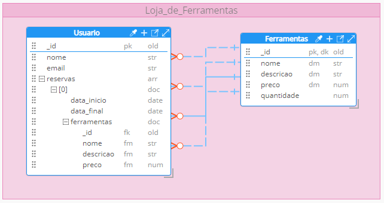

## Configuração de Ambiente

### Dependências

Para utilizar este projeto localmente, é necessário ter as seguintes ferramentas instaladas:

- Node.js (versão 14 ou superior) – Ambiente de execução JavaScript no servidor;
- MongoDB – Banco de dados NoSQL utilizado para armazenar os dados da aplicação.

Após instalar o Node.js e o MongoDB, você pode clonar este repositório usando o seguinte comando no terminal:

```
git clone https://github.com/Giovanni-dos-Santos/BDNR_USCS2025.git
```

Além disso, duas dependências principais são utilizadas no projeto:

- Express – Framework para construção da API de forma simples e organizada;
- Mongoose – ODM (Object Data Modeling) que facilita a interação entre a aplicação Node.js e o MongoDB.

Você pode instalar essas dependências manualmente com:
```
npm install express mongoose
```
Ou simplesmente instalar todas as dependências do projeto com:
```
npm install
```
### Inicialização do Servidor

Após a instalação das ferramentas necessárias, será preciso iniciar os servidores do MongoDB e do Node.js.

#### Iniciando o MongoDB

Por padrão, o serviço do MongoDB é configurado para iniciar automaticamente junto com o sistema operacional. No entanto, caso isso não ocorra, será necessário iniciá-lo manualmente: 

1. Abra o menu Serviços do seu sistema operacional
2. Localize o serviço chamado MongoDB
3. Clique com o botão direito sobre ele e selecione Iniciar.

#### Iniciando o servidor Node.js

Com o MongoDB já rodando, o próximo passo é iniciar a aplicação Node.js. Para isso:

1. Abra o terminal na raiz do projeto
2. Execute o seguinte comando:

```
node server.js
```

## Operações CRUD

A API desenvolvida permite realizar as quatro operações básicas de um sistema CRUD (Create, Read, Update, Delete) para os recursos:

- Ferramentas
- Usuários
- Reservas

Todos os exemplos de requisições apresentados abaixo foram testados e validados utilizando o Thunder Client, uma extensão do VSCode voltada para testes de APIs REST de forma rápida e integrada.

### Ferramentas

#### CREATE

- **Método:** `POST`  
- **Endpoint:** `/ferramentas`  
- **Body (JSON):**

```
{
  "nome": "Martelo",
  "descricao": "Martelo de Aço",
  "preco": 50.0,
  "quantidade": 20
}
```
- **Resultado:**

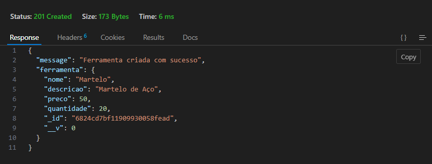


#### READ

- **Método:** `GET`  
- **Endpoint:** `/ferramentas`
- **Resultado:**

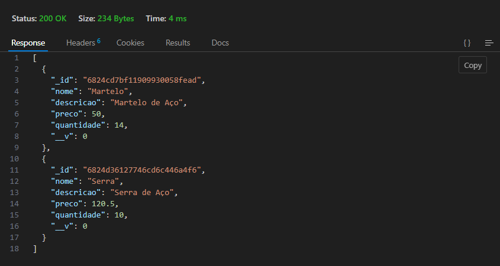


- **Método:** `GET`  
- **Endpoint:** `/ferramentas/<id-da-ferramenta>`
- **Resultado:**

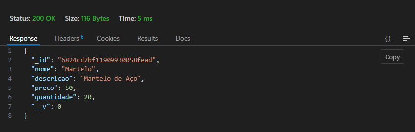

#### UPDATE

- **Método:** `PUT`  
- **Endpoint:** `/ferramentas/<id-da-ferramenta>`
- **Body (JSON):**

```
{
  "quantidade": 15
}
```
- **Resultado:**

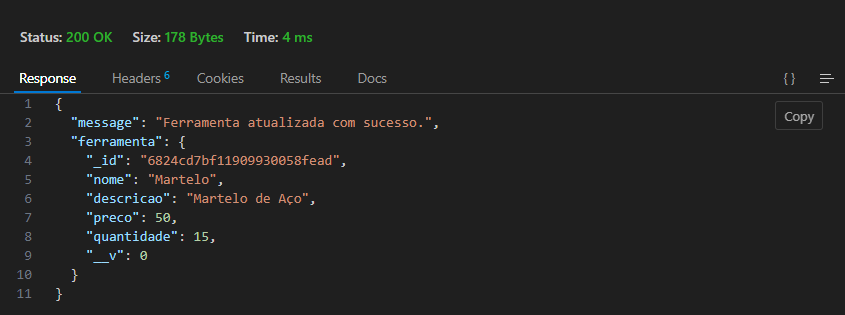

#### DELETE

- **Método:** `DELETE`
- **Endpoint:** `/ferramentas/<id-da-ferramenta>`
- **Resultado:**

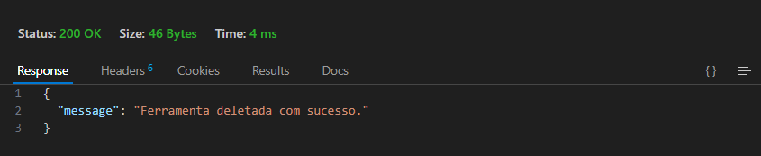

### Usuários

#### CREATE

- **Método:** `POST`  
- **Endpoint:** `/usuarios`  
- **Body (JSON):**

```
{
  "nome": "João",
  "email": "joao@gmail.com"
}
```
- **Resultado:**

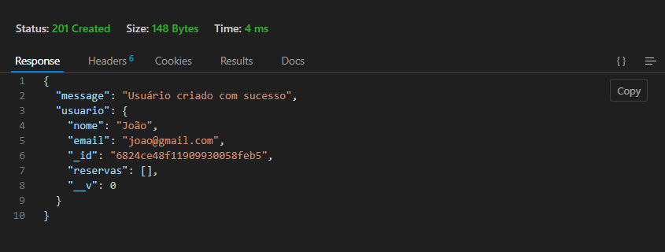

#### READ

- **Método:** `GET`  
- **Endpoint:** `/usuarios`
- **Resultado:**

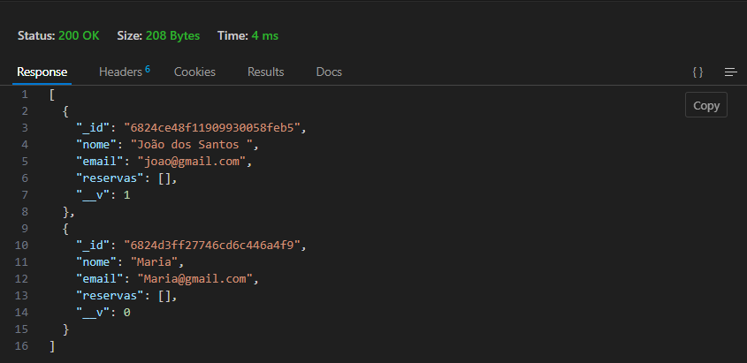

- **Método:** `GET`  
- **Endpoint:** `/usuarios/<id-do-usuario>`
- **Resultado:**

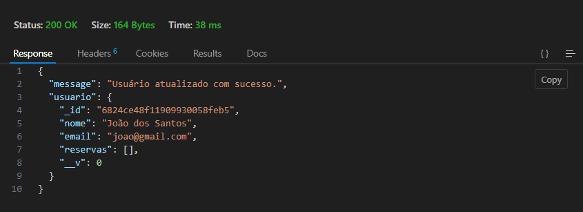

#### UPDATE

- **Método:** `PUT`  
- **Endpoint:** `/usuarios/<id-do-usuario>`
- **Body (JSON):**

```
{
  "nome": João dos Santos
}
```
- **Resultado:**

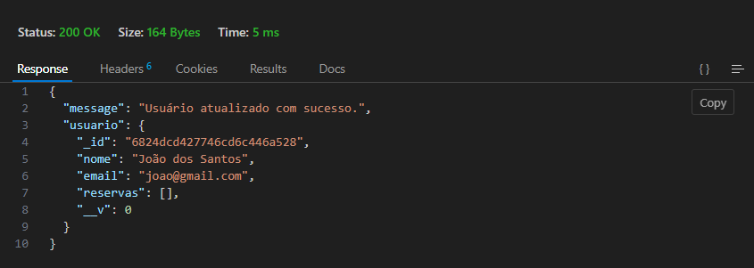

#### DELETE

- **Método:** `DELETE`
- **Endpoint:** `/usuarios/<id-do-usuario>`
- **Resultado:**

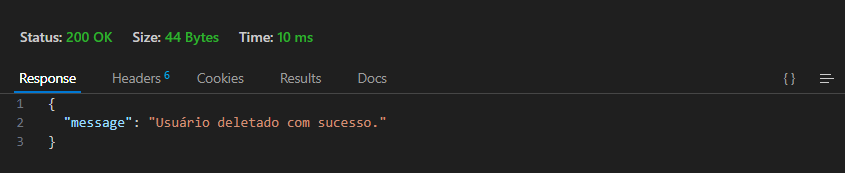

### Reservas 

#### CREATE

- **Método:** `POST`  
- **Endpoint:** `/usuarios/<id-do-usuario>/reservas`  
- **Body (JSON):**

```
{
  "ferramentaId": "6824bf1bf11909930058fe9b",
  "data_inicio": "2025-02-20",
  "data_final": "2025-04-20"
} 
```
- **Resultado:**

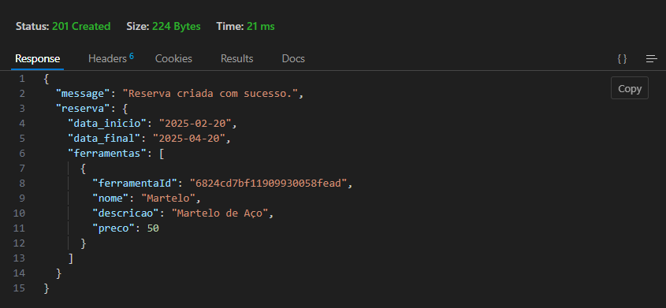

#### READ

- **Método:** `GET`  
- **Endpoint:** `/usuarios/reservas/ferramentas/<id-da-ferramenta`
- **Resultado:**

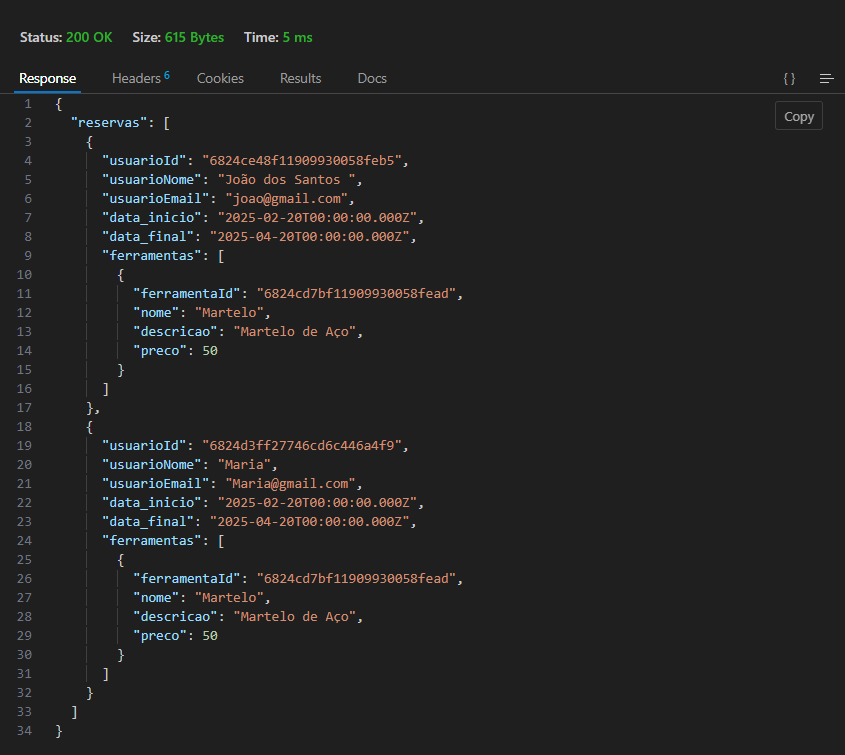

#### UPDATE

- **Método:** `PUT`  
- **Endpoint:** `/usuarios/<id-do-usuario>/reservas/<id-da-reserva>`
- **Body (JSON):**

```
{
  "data_inicio": "2025-02-28"
}
```
- **Resultado:**

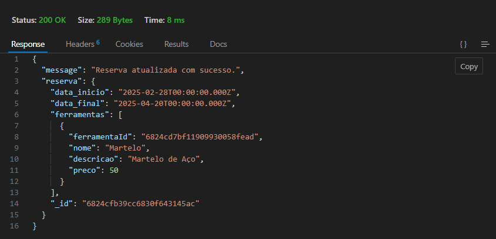

#### DELETE

- **Método:** `DELETE`
- **Endpoint:** `/usuarios/<id-do-usuario>/reservas/<id-da-reserva>`
- **Resultado:**

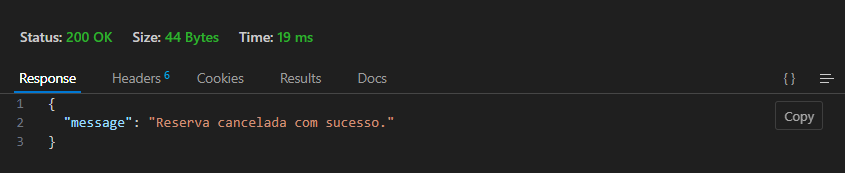